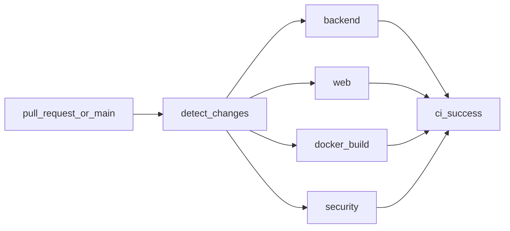

# CI Pipeline

Kaynak: [`.github/workflows/ci.yml`](../.github/workflows/ci.yml)

Deploy / GHCR / staging **yok** (sunucu gelince ayrı faz). Bu pipeline PR ve `main`/`master` için kalite kapısıdır.

## Akış



| Job | Ne zaman | Ne yapar |
|-----|----------|----------|
| `changes` | Her zaman | Path filter (`backend` / `web` / `docker`) |
| `backend` | `backend/**` veya workflow | `pytest` + coverage (`app.features`, `app.core`); XML artifact |
| `web` | `web/**`, `packages/**`, pnpm/turbo | **lint** (hard) → typecheck → build; `dist` artifact (3 gün) |
| `docker` | Dockerfile / compose / backend | Image build (`push: false`), import smoke, Trivy CRITICAL fail / HIGH report |
| `security` | Her zaman | Gitleaks + Trivy filesystem (CRITICAL fail / HIGH report) |
| `ci-success` | Her zaman (`always`) | Agregasyon: `failure`/`cancelled` → fail; `skipped` OK |

Concurrency: aynı ref’te eski run iptal edilir.

## Branch protection (manuel)

GitHub → **Settings → Branches → Branch protection rule** (`main`):

1. **Require status checks to pass before merging**
2. Required check: **`ci-success`** (tek kapı; path-skip’li job’lar protection’ı kırmaz)
3. (Önerilir) Require branches to be up to date

## Lokal komutlar

```bash
# Backend
cd backend && pip install -r requirements.txt
pytest -q --cov=app.features --cov=app.core --cov-report=term-missing

# Web
pnpm install --frozen-lockfile
pnpm --filter web lint
pnpm --filter web typecheck
pnpm --filter web build

# Docker smoke
docker build -t hastane-backend:ci ./backend
docker run --rm hastane-backend:ci python -c "import app.main"
```

## Bilinçli kapsam dışı

- GHCR push, SSH/compose deploy
- Playwright E2E, mobile Expo CI
- Coverage `fail-under` eşiği (rapor soft; hedef ≥ %60 — [test-plan.md](test-plan.md))
