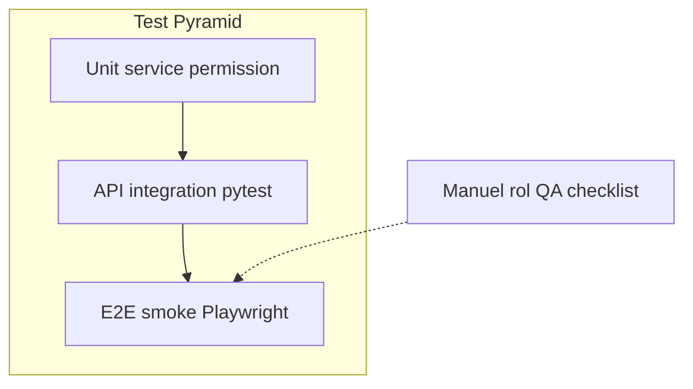
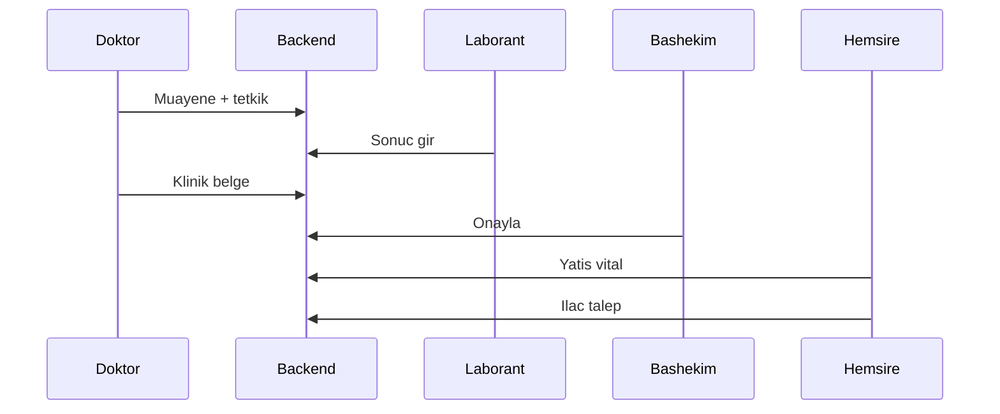

# HBYS — Kapsamlı Test Planı

**Ürün:** Çanakkale Mehmet Akif Ersoy Devlet Hastanesi Bilgi Yönetim Sistemi  
**Kapsam:** Backend API, personel web paneli, hasta mobil istemci  
**İlgili:** [qa-checklist.md](qa-checklist.md) (manuel yürütme), [PRODUCTION.md](PRODUCTION.md), [bashekim-izin-envanteri.md](bashekim-izin-envanteri.md), [ROADMAP.md](ROADMAP.md)

---

## 1. Amaç

Bu plan; güvenlik (RBAC/kapsam/KVKK), kritik klinik iş akışları ve rol panellerinin regresyonunu ölçülebilir hale getirir. P0 senaryolar release/PR gate adayıdır; P1 sprint içinde; P2 sonraki fazlarda kapatılır.

## 2. Kapsam ve kapsam dışı

### Kapsam içi

- Auth (JWT, refresh, OTP iskeleti, rate limit, onboarding)
- RBAC + sahiplik kapsamları (`GLOBAL` / `KENDI_KAYDIM` / `DEPARTMANIM`)
- Ambulatuvar (randevu, muayene, tetkik)
- Klinik belge onayı, epikriz, konsültasyon, sağlık kurulu
- Yatış / hemşire–ebe paneli (vital, MAR, ilaç talep, bildirim)
- Başhekim özet ve personel erişim onayı
- Güvenlik operasyon paneli
- Ops: nöbet, temizlik, şikayet-öneri
- Denetim / PHI görüntüleme logu

### Kapsam dışı (bilinçli)

- CCTV, turnike, Bakanlık Beyaz Kod portalı
- Gerçek SMS gateway / DLQ (Faz C tamamlanınca eklenir)
- Mobil App Store / cihaz matris testleri (şimdilik smoke)
- Performans yük / kaos mühendisliği (yalnızca hafif NFR smoke)

---

## 3. Roller ve test hesapları

| Rol | Demo e-posta | Not |
|-----|--------------|-----|
| ADMIN | `admin@hastane.example.com` | Wildcard + `personel:onay_bypass` |
| BASHEKIM | seed / panel | Özet, onay, denetim, MHRS… |
| MUDUR | `mudur@hastane.example.com` | Yönetim ortak; başhekim-özel 403 |
| DOKTOR | `doktor@hastane.example.com` | Kendi hasta/randevu |
| HEMSIRE | `hemsire@hastane.example.com` (H-001) | Servis-takip |
| EBE | `ebe@hastane.example.com` (E-001) | HEMSIRE path paritesi `/ebe` |
| LABORANT | `laborant@hastane.example.com` | Tetkik sonuç; yatış 403 |
| TEMIZLIK | `temizlik@hastane.example.com` | Kendi görev |
| GUVENLIK | `guvenlik@hastane.example.com` (G-001) | Olay yaşam döngüsü |
| HASTA | `hasta@hastane.example.com` | Mobil / web `/hasta` |

**Şifre (tümü):** `Test1234!`

Pytest seed: `backend/tests/conftest.py` → `seeded` (`*@t.test`).

---

## 4. Test piramidi ve araçlar

| Katman | Araç | Zorunluluk |
|--------|------|------------|
| Unit / matris | `pytest` (`kapsam_getir`, izin) | Evet |
| API entegrasyon | FastAPI `TestClient` + SQLite | Ana yük — Evet |
| Web tip güvenliği | `pnpm --filter web typecheck` | CI gate |
| Web unit (Vitest) | — | Bu fazda zorunlu değil |
| E2E smoke | Playwright (login → rol home) | Önce lokal; CI sonraki faz |
| Manuel QA | [qa-checklist.md](qa-checklist.md) | UI / görsel / parite |

**Test kökü hedefi:** `backend/tests/` (mevcut `backend/app/tests/` taşıması ayrı PR).

---

## 5. Ortam ve veri kuralları

| Ortam | Kullanım |
|-------|----------|
| Pytest (SQLite in-memory) | API/unit |
| Docker Compose (Postgres 16 + Redis) | Manuel QA, Celery import, E2E |
| CI Ubuntu | `pytest -q` + web typecheck |

Kurallar:

- Testler izole session kullanır; fixture sonrası override temizlenir.
- Klinik kayıtlar hard-delete edilmez (üretim kuralı; test assert’leri soft/işlem loguna bakar).
- PHI assert’lerinde yalnızca seed TC kullanılır.

---

## 6. Öncelik matrisi

### P0 — Bloker

| ID | Alan | Odak | Otomasyon | Manuel |
|----|------|------|-----------|--------|
| P0-AUTH | Auth | Login, refresh, logout, rate limit, şifre+KVKK, OTP iskeleti, `oturum_tipi` | `test_auth*.py` | Faz 1 |
| P0-RBAC | Yetki | Matris 403/200; BASHEKIM≠MUDUR; doktor global hasta 403; laborant yatış 403 | `test_rbac.py` + P0 suite | Faz G/H |
| P0-SCOPE | Kapsam | Randevu/hasta/tetkik sahiplik | RBAC + feature testleri | Faz 2–3, G |
| P0-RANDEVU | Ambulatuvar | Slot → randevu → doktor görür / başka görmez | `test_randevular` / rbac | Faz 2–3 |
| P0-MUAYENE | Klinik döngü | Muayene → tetkik → laborant sonuç | tetkik/muayene + checklist | Faz 4 |
| P0-YATIS | Yatış | `kapsam=benim`, vital, işlem logu, laborant 403 | `test_yatis.py` | Faz H |
| P0-ONAY | Klinik onay | Reçete/sevk/rapor → onay/red; müdür 403 | `test_klinik_onay.py` | Faz G |
| P0-ERISIM | Personel erişim | BEKLEMEDE → başhekim onay | `test_bashekim.py` + personel | Başhekim |

### P1 — Yüksek

- Epikriz taslak → doktor onay (`test_epikriz.py`)
- İlaç talep YENI/ONAY_BEKLIYOR → ONAYLANDI → VERILDI (`test_ilac_talep.py`)
- Konsültasyon / sağlık kurulu üyelik
- EBE ≡ HEMSIRE path paritesi
- Güvenlik olay yaşam döngüsü (`test_guvenlik.py` + Faz K)
- Denetim `KAYIT_GORUNTULEME`
- Personel CSV/XLSX import job

### P2 — Orta

- MHRS / E-Nabız / SGK mock
- Eczane / fatura / döner salt okuma
- Yetki devri / sistem gözetim
- Nöbet, temizlik, şikayet
- Laborant / temizlik panel derinliği
- Mobil hasta derin akışlar (Faz D)
- SMS / DLQ stub (Faz C sonrası)

---

## 7. Senaryo kataloğu

Her senaryo: **önkoşul → adımlar → beklenen → negatif → test dosyası**.

### 7.1 Auth (P0-AUTH)

| ID | Senaryo | Beklenen | Negatif | Dosya |
|----|---------|----------|---------|-------|
| A1 | Personel login | 200 + access/refresh | Yanlış şifre 401 | `test_auth.py` |
| A2 | Refresh | Yeni access | Logout sonrası geçersiz | `test_auth_extended.py` |
| A3 | Rate limit | Eşik sonrası 429 | — | auth extended |
| A4 | İlk giriş | Şifre değiştir + KVKK zorunlu | Atlanamaz | manuel + auth |
| A5 | Hasta OTP iskeleti | Gönder/doğrula akışı | Geçersiz OTP | auth |
| A6 | `oturum_tipi=hasta` | HASTA matrisi | Personel izni sızmaz | rbac/auth |

### 7.2 RBAC / kapsam (P0-RBAC, P0-SCOPE)

| ID | Senaryo | Beklenen | Negatif | Dosya |
|----|---------|----------|---------|-------|
| R1 | Admin randevu listesi | 200 | — | `test_rbac.py` |
| R2 | Laborant randevu | — | 403 | `test_rbac.py` |
| R3 | Doktor `GET /hastalar/` | — | 403 | rbac / checklist G |
| R4 | Doktor `/hastalar/benim` | Yalnızca kendi | Başka detay 403 | checklist G |
| R5 | Hemşire departman randevu | DEPARTMANIM | Diğer dep. yok | Faz 2–3 |
| R6 | MUDUR başhekim özet | — | 403 | `test_bashekim.py` |
| R7 | Laborant yatış listesi | — | 403 | `test_yatis.py` |

### 7.3 Ambulatuvar (P0-RANDEVU, P0-MUAYENE)

| ID | Senaryo | Beklenen | Negatif | Dosya |
|----|---------|----------|---------|-------|
| C1 | Hasta randevu oluştur | 201 | Doktor oluşturamaz 403 | `test_rbac.py` |
| C2 | Doktor kendi randevusu | Listede görünür | Başka doktorunki yok | checklist / randevu |
| C3 | Muayene + tetkik iste | Kayıt oluşur | Yetkisiz 403 | Faz 4 + matris |
| C4 | Laborant sonuç | SONUCLANDI | Doktor `tetkik:sonuc_gir` yoksa 403 | Faz 4 |
| C5 | Hasta sonucu görür | Mobil / API 200 | Başka hasta 403 | Faz 4 |

### 7.4 Klinik onay (P0-ONAY)

| ID | Senaryo | Beklenen | Negatif | Dosya |
|----|---------|----------|---------|-------|
| K1 | Doktor reçete/sevk/rapor | 201, BEKLEMEDE | Başka hasta 403 | `test_klinik_onay.py` |
| K2 | Başhekim onayla | ONAYLANDI + denetim | — | `test_klinik_onay.py` |
| K3 | Başhekim reddet | REDDEDILDI | — | `test_klinik_onay.py` |
| K4 | Müdür liste/onay | — | 403 | `test_klinik_onay.py` |

### 7.5 Yatış (P0-YATIS)

| ID | Senaryo | Beklenen | Negatif | Dosya |
|----|---------|----------|---------|-------|
| Y1 | Hemşire `GET /yatis/kayitlar?kapsam=benim` | Kendi servis/sorumlu | Laborant 403 | `test_yatis.py` |
| Y2 | Vital ekle | 201 | Yetkisiz 403 | `test_yatis.py` |
| Y3 | İşlem (kontrol toggle vb.) | Detay + işlem logu | — | `test_yatis.py` / manuel H |
| Y4 | Kritik vital → bildirim | Badge / bildirim | — | manuel Faz H |

### 7.6 Personel erişim + başhekim (P0-ERISIM)

| ID | Senaryo | Beklenen | Negatif | Dosya |
|----|---------|----------|---------|-------|
| E1 | `GET /bashekim/ozet` | 200 + sayaç alanları | Müdür 403 | `test_bashekim.py` |
| E2 | Erişim BEKLEMEDE → onayla | ONAYLANDI | Müdür onay 403 | `test_bashekim.py` |
| E3 | Admin bypass | Gerekçeli onay | BASHEKIM bypass yok | personel / envanter |

### 7.7 Epikriz / ilaç talep (P1)

| ID | Senaryo | Beklenen | Negatif | Dosya |
|----|---------|----------|---------|-------|
| P1-E | Hemşire taslak | TASLAK | Onaylıya patch 400 | `test_epikriz.py` |
| P1-E2 | Doktor onay | ONAYLANDI | — | `test_epikriz.py` |
| P1-I | Talep oluştur | ONAY_BEKLIYOR (gonder=true) | Pasif yatış 400 | `test_ilac_talep.py` |
| P1-I2 | Durum zinciri | ONAYLANDI → VERILDI | Yetkisiz 403 | `test_ilac_talep.py` |

### 7.8 Güvenlik (P1)

| ID | Senaryo | Beklenen | Negatif | Dosya |
|----|---------|----------|---------|-------|
| G1 | Olay oluştur → müdahale → çöz | Durum geçişleri | — | `test_guvenlik.py` + Faz K |
| G2 | Ziyaretçi / kayıp / devriye | CRUD smoke | — | `test_guvenlik.py` |
| G3 | Refakatçi sorgu | 200 | Yetkisiz 403 | manuel / API |

### 7.9 Ops / NFR

| ID | Senaryo | Beklenen |
|----|---------|----------|
| N1 | `GET /health` | 200 |
| N2 | Liste endpoint’leri (seed, compose) | &lt; 2s lokal |
| N3 | Personel import Celery | Job tamam / hata okunur |

---

## 8. Otomasyon gap tablosu

| Domain | Durum | Hedef dosya | Aksiyon |
|--------|-------|-------------|---------|
| auth | Var | `backend/tests/features/test_auth*.py` | P0 negatif güçlendir |
| rbac | Var | `backend/tests/features/test_rbac.py` | Koru |
| personel import | Var | `test_personel_import.py` | Koru |
| güvenlik | Kısmi | `test_guvenlik.py` | P1 yaşam döngüsü |
| randevu/hasta/muayene/tetkik | Kısmi / matris | `app/tests` + rbac | Scope 403 ekle |
| **yatis** | Eksikti | `backend/tests/features/test_yatis.py` | P0 |
| **klinik_onay** | Eksikti | `test_klinik_onay.py` | P0 |
| **epikriz** | Eksikti | `test_epikriz.py` | P1 |
| **ilac_talep** | Eksikti | `test_ilac_talep.py` | P1 |
| **bashekim** | Eksikti | `test_bashekim.py` | P0 |
| konsultasyon / saglik_kurulu | Yok | sonraki sprint | P1 |
| mhrs / entegrasyon / eczane / fatura / doner / yetki_devri | Yok | ince smoke | P2 |

**PR kuralı:** Yeni klinik feature → ilgili API test dosyası zorunlu.

---

## 9. Manuel QA

Yürütme listesi: [qa-checklist.md](qa-checklist.md).

| Faz | İçerik |
|-----|--------|
| 1–5 | Rol redirect, master data, randevu, tetkik, ops |
| G–J | Doktor / hemşire / ebe panelleri |
| **K** | Güvenlik paneli |
| **L** | Laborant / temizlik smoke |
| Müdür regresyon | [bashekim-izin-envanteri.md](bashekim-izin-envanteri.md) |

---

## 10. Güvenlik ve KVKK checklist (otomatik + manuel)

- [ ] Yetkisiz / yanlış rol → 403
- [ ] Hasta oturumunda personel izni sızmaz
- [ ] Refresh rotation / logout sonrası token geçersiz
- [ ] Login rate limit
- [ ] Kullanıcı soft deactivate; klinik hard-delete yok
- [ ] Denetim: aktör, aksiyon, kaynak, zaman (`KAYIT_GORUNTULEME`, `KLINIK_ONAY`)
- [ ] Prod: [PRODUCTION.md](PRODUCTION.md) secrets/CORS/HTTPS

---

## 11. CI ve coverage

Kaynak: [`.github/workflows/ci.yml`](../.github/workflows/ci.yml) — özet: [CI.md](CI.md)

| Faz | Gate |
|-----|------|
| **Şimdi** | Path-filtreli pipeline: backend pytest+coverage artifact; web **lint** (hard) + typecheck + build; Docker build smoke + Trivy; Gitleaks; tek required check `ci-success` |
| **Sonraki** | Coverage `fail-under` (hedef line ≥ %60); Playwright smoke |
| **Sonra** | GHCR + staging/prod deploy; mobile Expo CI |

---

## 12. Çıkış kriterleri

1. P0 senaryolarının %100’ü otomatik yeşil **veya** checklist’te işaretli.
2. CI `ci-success` yeşil (pytest, web lint/typecheck/build, security).
3. Prod öncesi: PRODUCTION güvenlik maddeleri + P0 manuel smoke.
4. Bilinen P1/P2 açıkları roadmap’te takip edilir; bloker sayılmaz.

---

## 13. Riskler

| Risk | Etki | Azaltma |
|------|------|---------|
| SQLite ≠ Postgres | Tip/constraint farkı | Kritik smoke compose’ta tekrar |
| Mock entegrasyonlar | Yanlış güvenlik hissi | P2’de sözleşme testleri |
| SMS / DLQ yok | Bildirim regressyonu | Faz C sonrası stub |
| Çift test kökü | Keşif zorluğu | Hedef `backend/tests/` |
| UI-only regresyon | Nav/renk kaçması | Manuel Faz H–K + ileride E2E |

---

## 14. Referans iş akışı (P0 klinik)

